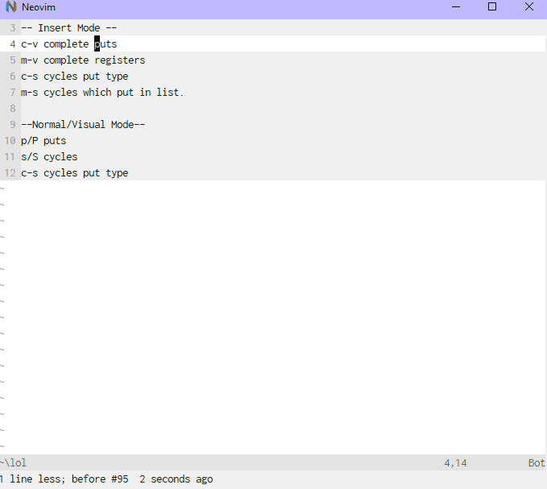

# Neovim Extract

<i>Extract; Draw forth what really matters</i>

## Extract puts and yanks to a list with normal, visual swapping, and insert list/register/deoplete completion.
##### Version 3
<a href="https://imgur.com/Q1f71tJ"></a>

##### Version 2
<a href="https://imgur.com/1wVXrki"></a>

##### Version 1


### Things to know

- You can still use `"<register>p/P`
    - Putting will add to the list if it's a new item.
- Yanking will add to the list if it's a new item.
- If you put/yank a duplicate, with a different \*-wise insertion,
  it will choose the newest \*-wise.
- If you put/yank a duplicate that is the same \*-wise, it will go
  to the top of the list, but not add a new occurance.
- If you yank just whitespace or tabs it will ignore it, assuming you don't
  alter the option.
- You're clipboards will be automatically pulled into the list on a timer, ignoring duplicates.

### Usage

#### Normal and Visual

##### Putting

Use `p`/`P` like normal, once you use it with different registers or you yank
text, it will add those to the list.  Then, you can use use `s` to go forward
in the list, and `S` to go backwards. If you want to change whether it pastes
linewise/blockwise/characther wise, hit c-s to cycle through them.

##### Swapping

Use `["reg]s` motion, this will delete and replace with the register you pick.
If no register is specified it will use the default.

##### Pinning

Use `<leader>p` to open a input to ask you which you would like to pin. After doing
this it will stay at the top of your list, so if even if you add more items to the list,
putting will still use that pinned value.

To unpin use `<leader>P`.

Optinonally you can use ExtractPin and ExtractUnPin on the command line as well.

#### Insert Mode

Use `c-v` to paste from the ring, this will make a popup for the ring with the most recent at the top,
descending to the least current.

Once selected you can continue typing like usual, or something I use a lot:
whenever I yank something, it's usually linewise (like `yy`), which means
that it puts mean on a new line after putting the text, if you then type
`<c-s>` to complete it, it will then switch the *-wise and put you in
front of the completed text.

Use `<m-s\S>` to cycle inside the ring while inside of insert mode.

Use `<m-v>` to show a popup menu you for your registers.


### Global options

| Flag                           | Default                           | Description                                                                                |
| -------------------            | --------------------------------- | ------------------------------------------------------                                     |
| `g:extract_maxCount`           | 5                                 | How many yanks do you want to save in the list? I use 25                                   |
| `g:extract_defaultRegister`    | '0'                               | Registered used to perform opeartions, it is set back to whatever it was previously after. |
| `g:extract_ignoreRegisters`    | ['a', '.']                        | What registers to ignore                                                                   |
| `g:extract_clipCheck`          | &updatetime                       | How often to check for clipboard changes                                                   |
| `g:extract_ignoreJustSpaces`   | &updatetime                       | How often to check for clipboard changes                                                   |
| `g:extract_useDefaultMappings` | 1                                 | Use the default mappings                                                                   |
| `g:extract_loadDeoplete`       | 0                                 | Use deoplete?                                                                              |

### I Don't Like your mappings...

It's cool, just map these

```vim
```
    " mappings for putting
    nmap p <Plug>(extract-put)
    nmap P <Plug>(extract-Put)
    
    nmap <leader>p :ExtractPin<cr>
    nmap <leader>P :ExtractUnPin<cr>

    " mappings for cycling
    map <m-s> <Plug>(extract-sycle)
    map <m-S> <Plug>(extract-Sycle)
    map <c-s> <Plug>(extract-cycle)

    " mappings for visual
    vmap p <Plug>(extract-put)
    vmap P <Plug>(extract-Put)

    " mappings for insert
    imap <m-v> <Plug>(extract-completeReg)
    imap <c-v> <Plug>(extract-completeList)
    imap <c-s> <Plug>(extract-cycle)
    imap <m-s> <Plug>(extract-sycle)
    imap <m-S> <Plug>(extract-Sycle)

    " mappings for replace
    nmap <silent> s <Plug>(extract-replace-normal)
    vmap <silent> s <Plug>(extract-replace-visual)
##### Todo

- Register completion by using the register name.
